# Pythonでグラフを作成する完全ガイド

このチュートリアルでは、Pythonを使用してさまざまな種類のグラフを作成する方法を、実際のサンプルコードとともに説明します。主にMatplotlibとSeabornライブラリを使用します。

## 目次
1. [必要なライブラリのインストール](#必要なライブラリのインストール)
2. [基本的なグラフの種類](#基本的なグラフの種類)
   - [折れ線グラフ（Line Plot）](#1-折れ線グラフline-plot)
   - [棒グラフ（Bar Chart）](#2-棒グラフbar-chart)
   - [散布図（Scatter Plot）](#3-散布図scatter-plot)
   - [ヒストグラム（Histogram）](#4-ヒストグラムhistogram)
   - [円グラフ（Pie Chart）](#5-円グラフpie-chart)
   - [ヒートマップ（Heatmap）](#6-ヒートマップheatmap)
   - [箱ひげ図（Box Plot）](#7-箱ひげ図box-plot)
   - [3Dプロット](#8-3dプロット)

## 必要なライブラリのインストール

まず、必要なライブラリをインストールします：

```bash
pip install matplotlib seaborn pandas numpy
```

## 基本的なインポート

すべてのサンプルで以下のインポートを使用します：

```python
# ===== 必要なライブラリのインポート =====
import matplotlib.pyplot as plt  # グラフ作成の基本ライブラリ
import seaborn as sns           # きれいなグラフを簡単に作成できるライブラリ
import numpy as np              # 数値計算用ライブラリ（配列や数学関数）
import pandas as pd             # データ分析用ライブラリ（表形式のデータ処理）

# ===== 日本語フォントの設定 =====
# グラフで日本語を表示するための設定
plt.rcParams['font.family'] = 'DejaVu Sans'  # 基本フォント
# Windows環境では以下を使用（コメントを外して使用）
# plt.rcParams['font.family'] = 'MS Gothic'  # Windows用日本語フォント

# ===== グラフのスタイル設定 =====
# グラフの見た目を設定（whitegrid: 白背景に薄いグリッド線）
sns.set_style("whitegrid")
```

## 基本的なグラフの種類

### 1. 折れ線グラフ（Line Plot）

時系列データや連続的な変化を表現するのに適しています。

#### 基本的な折れ線グラフ

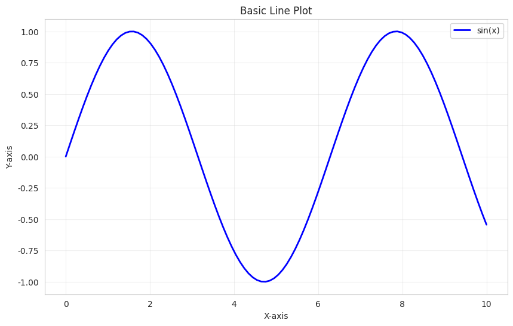

```python
# ===== データの準備 =====
# linspace(開始, 終了, 個数): 等間隔の数値を生成
# 0から10まで100個の等間隔な数値を作成
x = np.linspace(0, 10, 100)
# sin関数を使って、xの各値に対するy値を計算
y = np.sin(x)

# ===== グラフの作成 =====
# figure: 新しいグラフウィンドウを作成
# figsize=(幅, 高さ): グラフのサイズを指定（単位: インチ）
plt.figure(figsize=(10, 6))

# plot: 折れ線グラフを描画
# x: X軸のデータ、y: Y軸のデータ
# label: 凡例に表示するラベル名
# color: 線の色（'blue', 'red', 'green'など）
# linewidth: 線の太さ（数値が大きいほど太い）
plt.plot(x, y, label='sin(x)', color='blue', linewidth=2)

# xlabel/ylabel: 軸ラベルを設定
plt.xlabel('X軸')
plt.ylabel('Y軸')

# title: グラフのタイトルを設定
plt.title('基本的な折れ線グラフ')

# legend: 凡例を表示（labelで指定した内容が表示される）
plt.legend()

# grid: グリッド線を表示
# True: グリッドを表示、alpha: 透明度（0-1、小さいほど薄い）
plt.grid(True, alpha=0.3)

# show: グラフを画面に表示
plt.show()
```

#### 複数の折れ線グラフ

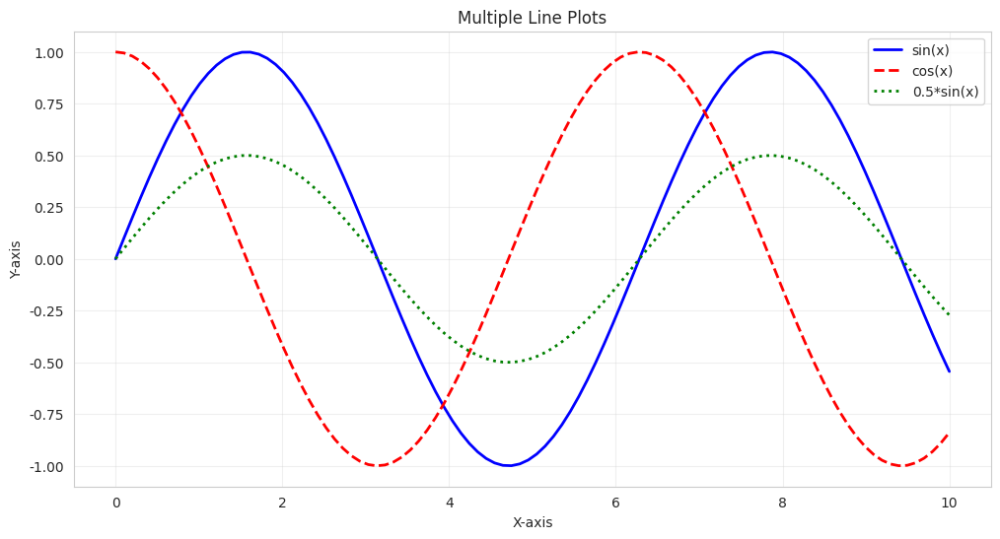

```python
# ===== データの準備 =====
# 共通のX軸データ（0から10まで100個の点）
x = np.linspace(0, 10, 100)
# 3つの異なる関数でY値を計算
y1 = np.sin(x)      # サイン関数
y2 = np.cos(x)      # コサイン関数
y3 = np.sin(x) * 0.5  # サイン関数の振幅を半分にしたもの

# ===== グラフの作成 =====
plt.figure(figsize=(12, 6))

# 複数のplot関数を使って、複数の線を重ねて描画
# linestyle: 線のスタイル
#   '-'  : 実線（デフォルト）
#   '--' : 破線
#   ':'  : 点線
#   '-.' : 一点鎖線
plt.plot(x, y1, label='sin(x)', color='blue', linewidth=2)
plt.plot(x, y2, label='cos(x)', color='red', linewidth=2, linestyle='--')
plt.plot(x, y3, label='0.5*sin(x)', color='green', linewidth=2, linestyle=':')

plt.xlabel('X軸')
plt.ylabel('Y軸')
plt.title('複数の折れ線グラフ')

# legend: 凡例の表示
# loc: 凡例の位置を指定
#   'upper right' : 右上
#   'upper left'  : 左上
#   'lower right' : 右下
#   'lower left'  : 左下
#   'center'      : 中央
plt.legend(loc='upper right')
plt.grid(True, alpha=0.3)
plt.show()
```

#### 時系列データの折れ線グラフ

```python
# ===== データの準備 =====
# date_range: 日付の連続データを作成
# '2024-01-01': 開始日
# periods=365: 365個のデータ（1年分）
# freq='D': 頻度（'D'=Daily=日単位、'M'=Monthly=月単位、'Y'=Yearly=年単位）
dates = pd.date_range('2024-01-01', periods=365, freq='D')

# ランダムな変化を累積して時系列データを作成
# randn(365): 平均0、標準偏差1の正規分布から365個の乱数を生成
# cumsum(): 累積和（前の値に足し続ける）で推移を表現
# +100: 基準値を100に設定
values = np.cumsum(np.random.randn(365)) + 100

# ===== DataFrameの作成 =====
# DataFrame: pandasの表形式データ構造
# 辞書形式でカラム名とデータを指定
df = pd.DataFrame({'日付': dates, '値': values})

# ===== グラフの作成 =====
plt.figure(figsize=(14, 6))
# DataFrameのカラムを使ってプロット
# df['日付']: 日付カラムをX軸に
# df['値']: 値カラムをY軸に
plt.plot(df['日付'], df['値'], color='darkblue', linewidth=1.5)
plt.xlabel('日付')
plt.ylabel('値')
plt.title('時系列データの推移')
# xticks(rotation=45): X軸のラベルを45度回転（日付が重ならないように）
plt.xticks(rotation=45)
# tight_layout(): レイアウトを自動調整（ラベルが切れないように）
plt.tight_layout()
plt.show()
```

### 2. 棒グラフ（Bar Chart）

カテゴリ別のデータを比較するのに適しています。

#### 基本的な棒グラフ

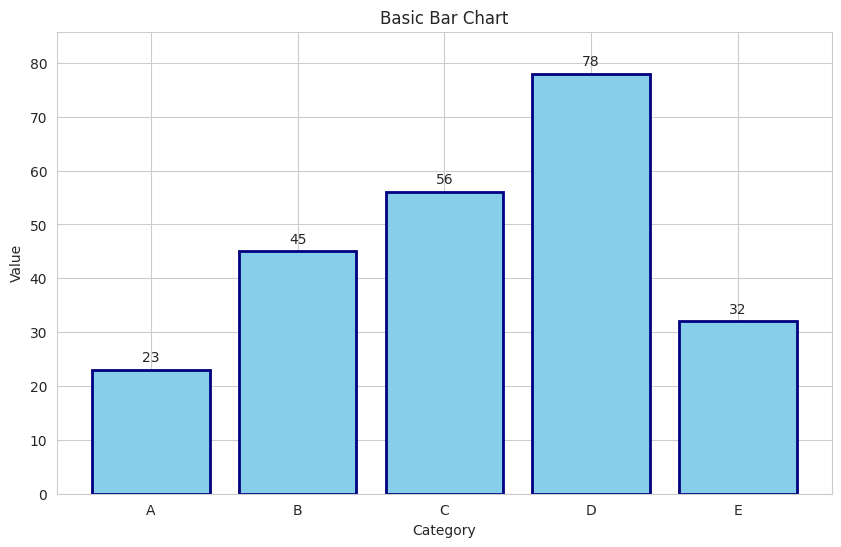

```python
# ===== データの準備 =====
# カテゴリ名のリスト
categories = ['A', 'B', 'C', 'D', 'E']
# 各カテゴリに対応する値のリスト
values = [23, 45, 56, 78, 32]

# ===== グラフの作成 =====
plt.figure(figsize=(10, 6))
# bar: 縦棒グラフを作成
# categories: X軸のラベル
# values: 各棒の高さ
# color: 棒の塗りつぶし色
# edgecolor: 棒の枠線の色
# linewidth: 枠線の太さ
bars = plt.bar(categories, values, color='skyblue', edgecolor='navy', linewidth=2)

# ===== 値をバーの上に表示 =====
# 各棒グラフの上に数値を表示するループ
for bar in bars:
    # get_height(): 棒の高さ（Y値）を取得
    height = bar.get_height()
    # text: テキストを配置
    # bar.get_x() + bar.get_width()/2.: 棒の中央のX座標
    # height + 1: 棒の上端より少し上のY座標
    # ha='center': 水平方向の配置（中央揃え）
    # va='bottom': 垂直方向の配置（下揃え）
    plt.text(bar.get_x() + bar.get_width()/2., height + 1,
             f'{height}', ha='center', va='bottom')

plt.xlabel('カテゴリ')
plt.ylabel('値')
plt.title('基本的な棒グラフ')
# ylim: Y軸の表示範囲を設定
# 0から最大値の1.1倍まで（上部に余白を作る）
plt.ylim(0, max(values) * 1.1)
plt.show()
```

#### 横向き棒グラフ

```python
# ===== データの準備 =====
categories = ['製品A', '製品B', '製品C', '製品D', '製品E']
sales = [156, 234, 189, 267, 198]

# ===== グラフの作成 =====
plt.figure(figsize=(10, 6))
# barh: 横棒グラフを作成（hはhorizontalの意味）
# bar()との違い: X軸とY軸が入れ替わる
bars = plt.barh(categories, sales, color='lightgreen', edgecolor='darkgreen')

# ===== 値をバーの右に表示 =====
for bar in bars:
    # get_width(): 横棒の幅（X値）を取得
    width = bar.get_width()
    # text: テキストを配置
    # width + 3: 棒の右端より少し右のX座標
    # bar.get_y() + bar.get_height()/2.: 棒の中央のY座標
    # ha='left': 水平方向の配置（左揃え）
    # va='center': 垂直方向の配置（中央揃え）
    plt.text(width + 3, bar.get_y() + bar.get_height()/2.,
             f'{width}', ha='left', va='center')

plt.xlabel('売上（万円）')
plt.ylabel('製品')
plt.title('製品別売上（横棒グラフ）')
plt.xlim(0, max(sales) * 1.1)
plt.show()
```

#### グループ化された棒グラフ

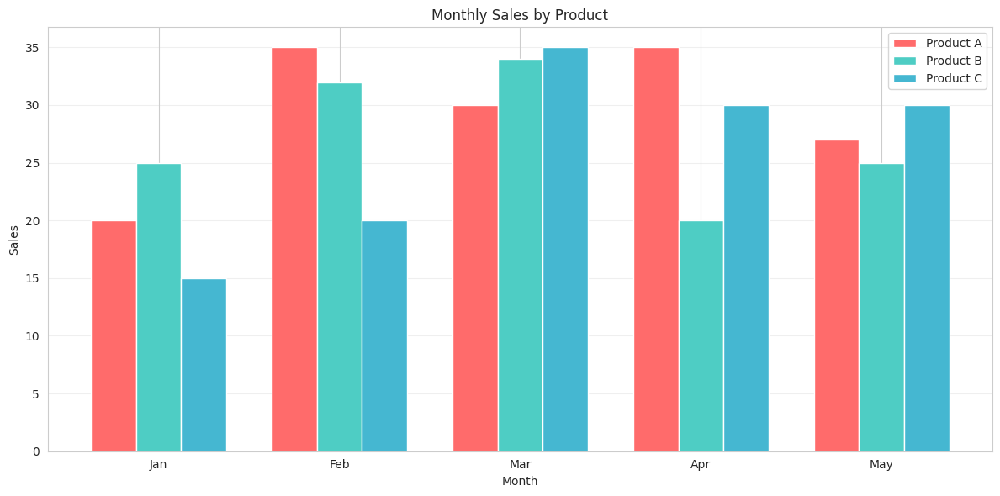

```python
# データの準備
categories = ['1月', '2月', '3月', '4月', '5月']
product_A = [20, 35, 30, 35, 27]
product_B = [25, 32, 34, 20, 25]
product_C = [15, 20, 35, 30, 30]

x = np.arange(len(categories))
width = 0.25

# グラフの作成
fig, ax = plt.subplots(figsize=(12, 6))
rects1 = ax.bar(x - width, product_A, width, label='製品A', color='#FF6B6B')
rects2 = ax.bar(x, product_B, width, label='製品B', color='#4ECDC4')
rects3 = ax.bar(x + width, product_C, width, label='製品C', color='#45B7D1')

ax.set_xlabel('月')
ax.set_ylabel('売上（万円）')
ax.set_title('月別・製品別売上')
ax.set_xticks(x)
ax.set_xticklabels(categories)
ax.legend()
ax.grid(True, alpha=0.3, axis='y')

plt.tight_layout()
plt.show()
```

### 3. 散布図（Scatter Plot）

2つの変数の関係性を表現するのに適しています。

#### 基本的な散布図

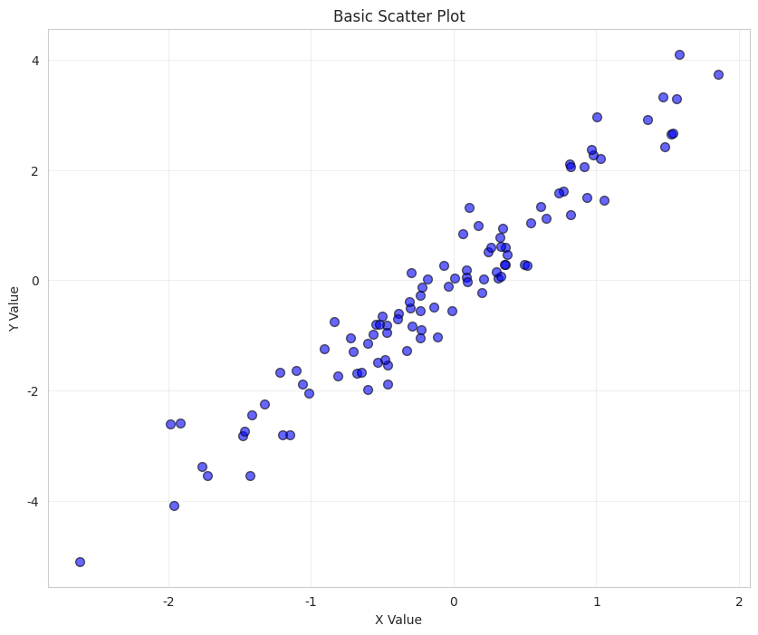

```python
# ===== データの準備 =====
# random.seed(42): 乱数のシード値を固定（同じ結果を再現できる）
np.random.seed(42)
# randn(100): 標準正規分布から100個の乱数を生成
x = np.random.randn(100)
# yはxと相関のあるデータ（y = 2x + ノイズ）
y = 2 * x + np.random.randn(100) * 0.5

# ===== グラフの作成 =====
plt.figure(figsize=(10, 8))
# scatter: 散布図を作成
# x, y: 各点のX座標とY座標
# alpha: 透明度（0-1、重なりを見やすくする）
# s: 点のサイズ（ピクセル単位）
# c: 点の色（'blue', 'red'など、またはカラーマップ）
# edgecolors: 点の枠線の色
# linewidth: 枠線の太さ
plt.scatter(x, y, alpha=0.6, s=50, c='blue', edgecolors='black', linewidth=1)
plt.xlabel('X値')
plt.ylabel('Y値')
plt.title('基本的な散布図')
plt.grid(True, alpha=0.3)
plt.show()
```

#### カラーマップを使用した散布図

```python
# ===== データの準備 =====
np.random.seed(42)
n = 150  # データ点の個数
x = np.random.randn(n)  # X座標
y = np.random.randn(n)  # Y座標
# 各点に異なる色を割り当てるための値
colors = np.random.randn(n)
# 各点に異なるサイズを割り当て（abs()で絶対値を取り負の値を避ける）
sizes = np.abs(np.random.randn(n)) * 100

# ===== グラフの作成 =====
plt.figure(figsize=(12, 8))
# scatter: 散布図を作成
# c=colors: 各点の色を配列で指定
# s=sizes: 各点のサイズを配列で指定
# cmap: カラーマップ（'viridis', 'coolwarm', 'jet'など）
scatter = plt.scatter(x, y, c=colors, s=sizes, alpha=0.5, cmap='viridis')
# colorbar: カラーバー（色と値の対応を表示）を追加
plt.colorbar(scatter, label='カラー値')
plt.xlabel('X値')
plt.ylabel('Y値')
plt.title('カラーマップとサイズを使用した散布図')
plt.grid(True, alpha=0.3)
plt.show()
```

#### 回帰線付き散布図

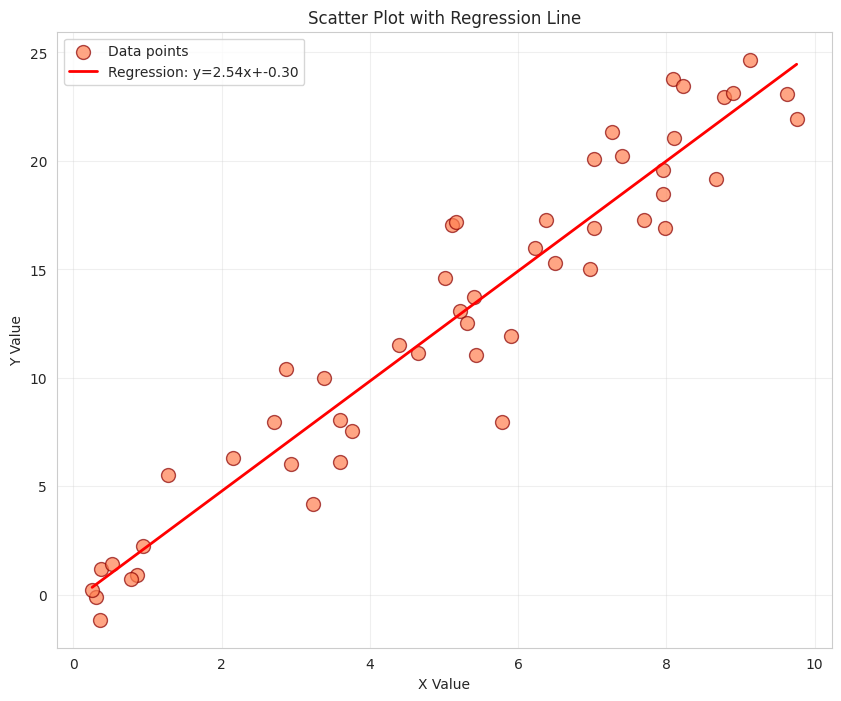

```python
# ===== データの準備 =====
np.random.seed(42)
# uniform(0, 10, 50): 0から10の範囲で一様分布の乱数を50個生成
x = np.random.uniform(0, 10, 50)
# y = 2.5x + ノイズ（線形関係を持つデータ）
y = 2.5 * x + np.random.normal(0, 2, 50)

# ===== 回帰線の計算 =====
# polyfit(x, y, 次数): 最小二乗法で多項式近似
# 1次（直線）の近似を行い、係数を取得
z = np.polyfit(x, y, 1)  # z[0]=傾き、z[1]=切片
# poly1d: 多項式関数を作成
p = np.poly1d(z)

# ===== グラフの作成 =====
plt.figure(figsize=(10, 8))
# 散布図でデータ点を表示
plt.scatter(x, y, alpha=0.7, s=100, c='coral', edgecolors='darkred', linewidth=1, label='データ点')
# 回帰線を描画
# p(x): xの各値に対する回帰線上のy値を計算
# "r-": 赤色の実線（'r'=red, '-'=実線）
# f文字列で回帰式を凡例に表示
plt.plot(x, p(x), "r-", linewidth=2, label=f'回帰線: y={z[0]:.2f}x+{z[1]:.2f}')
plt.xlabel('X値')
plt.ylabel('Y値')
plt.title('回帰線付き散布図')
plt.legend()
plt.grid(True, alpha=0.3)
plt.show()
```

### 4. ヒストグラム（Histogram）

データの分布を表現するのに適しています。

#### 基本的なヒストグラム

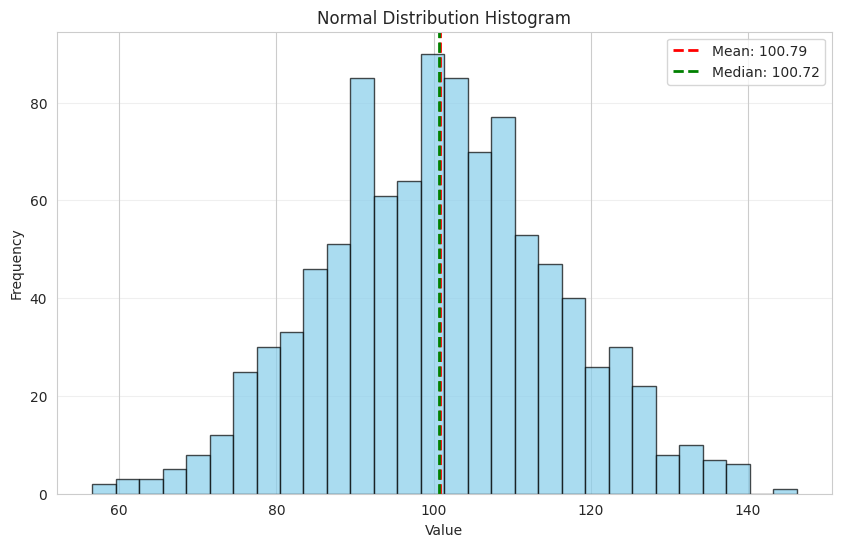

```python
# ===== データの準備 =====
np.random.seed(42)
# normal(平均, 標準偏差, 個数): 正規分布からデータを生成
# 平均100、標準偏差15の正規分布から1000個のデータを生成
data = np.random.normal(100, 15, 1000)

# ===== グラフの作成 =====
plt.figure(figsize=(10, 6))
# hist: ヒストグラム（度数分布図）を作成
# data: 描画するデータ
# bins: ビン（階級）の数。データを何個の区間に分けるか
# 戻り値: n=各ビンの度数、bins=ビンの境界値、patches=描画されたバー
n, bins, patches = plt.hist(data, bins=30, color='skyblue', edgecolor='black', alpha=0.7)

# ===== 統計値の線を追加 =====
# axvline: 垂直線を追加（x軸の特定の値に線を引く）
# data.mean(): データの平均値を計算
# linestyle='dashed': 破線
plt.axvline(data.mean(), color='red', linestyle='dashed', linewidth=2, label=f'平均値: {data.mean():.2f}')
# np.median(): データの中央値を計算
plt.axvline(np.median(data), color='green', linestyle='dashed', linewidth=2, label=f'中央値: {np.median(data):.2f}')

plt.xlabel('値')
plt.ylabel('頻度')
plt.title('正規分布のヒストグラム')
plt.legend()
# axis='y': Y軸方向のみグリッドを表示
plt.grid(True, alpha=0.3, axis='y')
plt.show()
```

#### 複数のヒストグラム（重ね合わせ）

```python
# データの準備
np.random.seed(42)
data1 = np.random.normal(100, 15, 1000)
data2 = np.random.normal(130, 20, 1000)

# グラフの作成
plt.figure(figsize=(12, 6))
plt.hist(data1, bins=30, alpha=0.5, label='グループA', color='blue', edgecolor='black')
plt.hist(data2, bins=30, alpha=0.5, label='グループB', color='red', edgecolor='black')

plt.xlabel('値')
plt.ylabel('頻度')
plt.title('複数グループのヒストグラム比較')
plt.legend(loc='upper right')
plt.grid(True, alpha=0.3, axis='y')
plt.show()
```

#### 2次元ヒストグラム

```python
# データの準備
np.random.seed(42)
x = np.random.normal(0, 1, 1000)
y = np.random.normal(0, 1, 1000)

# グラフの作成
plt.figure(figsize=(10, 8))
plt.hist2d(x, y, bins=30, cmap='Blues')
plt.colorbar(label='頻度')
plt.xlabel('X値')
plt.ylabel('Y値')
plt.title('2次元ヒストグラム')
plt.show()
```

### 5. 円グラフ（Pie Chart）

全体に対する各部分の割合を表現するのに適しています。

#### 基本的な円グラフ

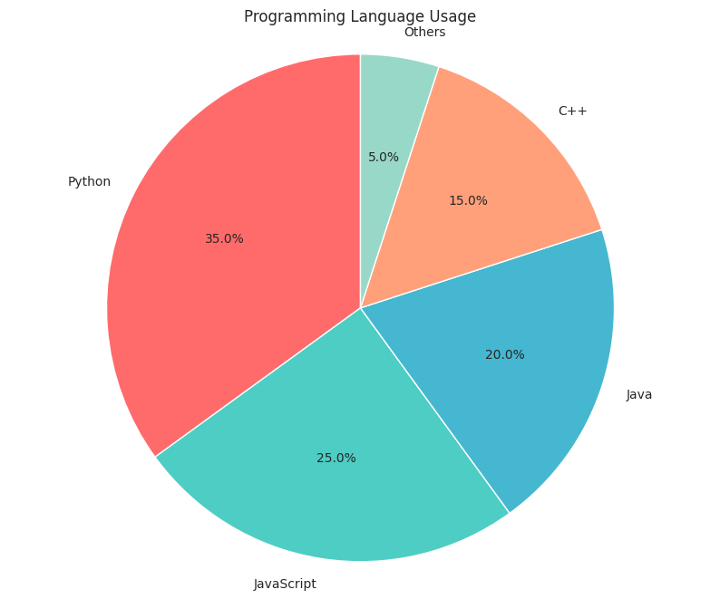

```python
# ===== データの準備 =====
# 各セクターのラベル
labels = ['Python', 'JavaScript', 'Java', 'C++', 'Others']
# 各セクターのサイズ（割合）
sizes = [35, 25, 20, 15, 5]
# 各セクターの色（カラーコードで指定）
colors = ['#FF6B6B', '#4ECDC4', '#45B7D1', '#FFA07A', '#98D8C8']

# ===== グラフの作成 =====
plt.figure(figsize=(10, 8))
# pie: 円グラフを作成
# sizes: 各セクターの大きさ
# labels: 各セクターのラベル
# colors: 各セクターの色
# autopct: パーセンテージ表示のフォーマット（'%1.1f%%' = 小数点1位まで表示）
# startangle: 最初のセクターの開始角度（時計の12時の位置が0度）
plt.pie(sizes, labels=labels, colors=colors, autopct='%1.1f%%', startangle=90)
plt.title('プログラミング言語の使用割合')
# axis('equal'): 縦横比を等しくして真円にする
plt.axis('equal')
plt.show()
```

#### 一部を強調した円グラフ

```python
# ===== データの準備 =====
labels = ['製品A', '製品B', '製品C', '製品D', '製品E']
sizes = [30, 25, 20, 15, 10]
colors = ['gold', 'yellowgreen', 'lightcoral', 'lightskyblue', 'orange']
# explode: 各セクターの引き出し量
# 0.1 = 10%引き出し、0 = 引き出しなし
# 最初の要素（製品A）だけを0.1引き出し
explode = (0.1, 0, 0, 0, 0)

# ===== グラフの作成 =====
plt.figure(figsize=(10, 8))
# pie: 円グラフを作成
# explode: セクターの引き出し
# shadow: 影をつける（Trueで立体的に見える）
# startangle: 開始角度を140度に設定
plt.pie(sizes, explode=explode, labels=labels, colors=colors,
        autopct='%1.1f%%', shadow=True, startangle=140)
plt.title('製品別売上構成比（製品Aを強調）')
plt.axis('equal')
plt.show()
```

#### ドーナツグラフ

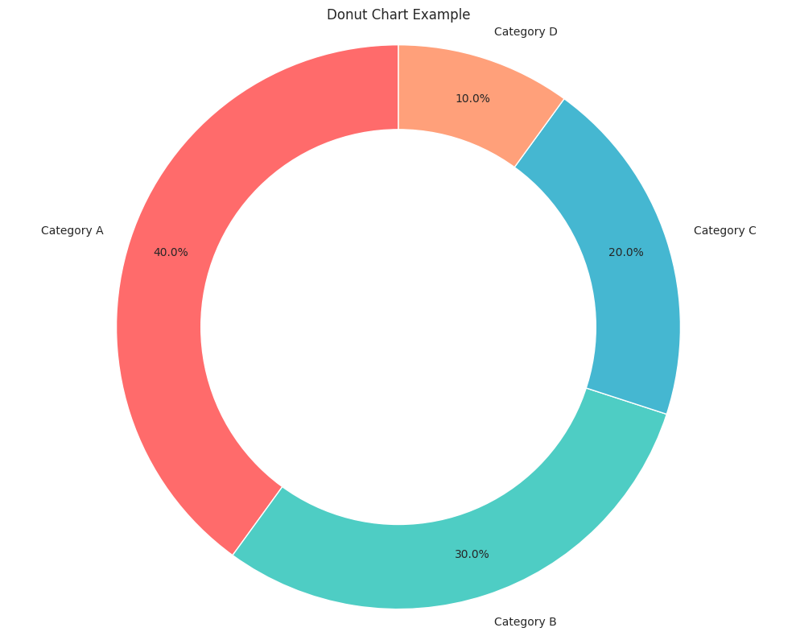

```python
# ===== データの準備 =====
labels = ['カテゴリA', 'カテゴリB', 'カテゴリC', 'カテゴリD']
sizes = [40, 30, 20, 10]
colors = ['#FF6B6B', '#4ECDC4', '#45B7D1', '#FFA07A']

# ===== グラフの作成 =====
# subplots: 図と軸を同時に作成
fig, ax = plt.subplots(figsize=(10, 8))
# pie関数の戻り値を取得
# wedges: 各セクターのオブジェクト
# texts: ラベルのテキストオブジェクト
# autotexts: パーセンテージのテキストオブジェクト
# pctdistance: パーセンテージ表示の位置（0.85 = 中心から85%の位置）
wedges, texts, autotexts = ax.pie(sizes, labels=labels, colors=colors,
                                    autopct='%1.1f%%', startangle=90,
                                    pctdistance=0.85)

# ===== 中心に白い円を作成してドーナツ型にする =====
# Circle((x, y), 半径, fc=塗りつぶし色)
# 中心(0,0)に半径0.70の白い円を作成
centre_circle = plt.Circle((0, 0), 0.70, fc='white')
# gca(): 現在の軸を取得し、add_artist()で円を追加
fig.gca().add_artist(centre_circle)

plt.title('ドーナツグラフのサンプル')
plt.axis('equal')
plt.tight_layout()
plt.show()
```

### 6. ヒートマップ（Heatmap）

2次元データの値を色で表現するのに適しています。

#### 基本的なヒートマップ

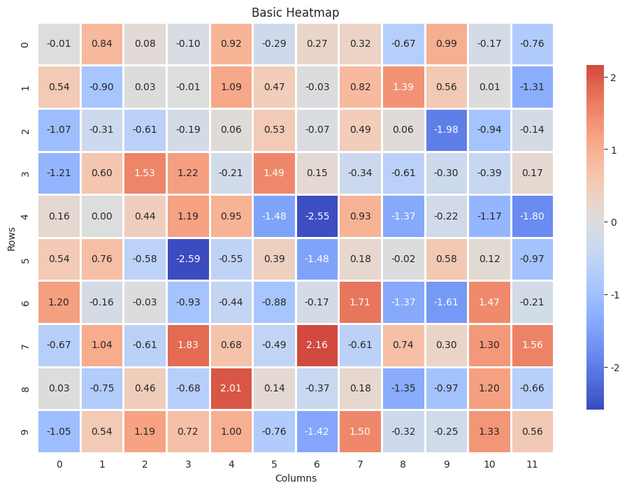

```python
# データの準備
np.random.seed(42)
data = np.random.randn(10, 12)

# グラフの作成
plt.figure(figsize=(12, 8))
sns.heatmap(data, annot=True, fmt='.2f', cmap='coolwarm', center=0,
            square=True, linewidths=1, cbar_kws={"shrink": 0.8})
plt.title('基本的なヒートマップ')
plt.xlabel('列')
plt.ylabel('行')
plt.show()
```

#### 相関行列のヒートマップ

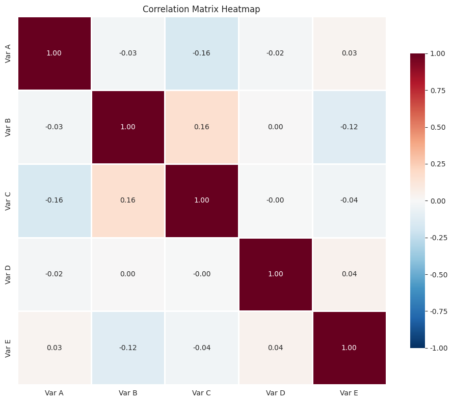

```python
# データの準備
np.random.seed(42)
df = pd.DataFrame({
    '変数A': np.random.randn(100),
    '変数B': np.random.randn(100),
    '変数C': np.random.randn(100),
    '変数D': np.random.randn(100),
    '変数E': np.random.randn(100)
})

# 相関行列の計算
correlation_matrix = df.corr()

# グラフの作成
plt.figure(figsize=(10, 8))
sns.heatmap(correlation_matrix, annot=True, fmt='.2f', cmap='RdBu_r',
            center=0, square=True, linewidths=1,
            cbar_kws={"shrink": 0.8}, vmin=-1, vmax=1)
plt.title('相関行列のヒートマップ')
plt.tight_layout()
plt.show()
```

#### カスタムカラーマップのヒートマップ

```python
# データの準備
months = ['1月', '2月', '3月', '4月', '5月', '6月',
          '7月', '8月', '9月', '10月', '11月', '12月']
products = ['製品A', '製品B', '製品C', '製品D', '製品E']

# ランダムな売上データを生成
np.random.seed(42)
sales_data = np.random.randint(50, 200, size=(len(products), len(months)))

# DataFrameの作成
df_sales = pd.DataFrame(sales_data, index=products, columns=months)

# グラフの作成
plt.figure(figsize=(14, 6))
sns.heatmap(df_sales, annot=True, fmt='d', cmap='YlOrRd',
            linewidths=0.5, cbar_kws={"label": "売上（万円）"})
plt.title('月別・製品別売上ヒートマップ')
plt.ylabel('製品')
plt.xlabel('月')
plt.tight_layout()
plt.show()
```

### 7. 箱ひげ図（Box Plot）

データの分布と外れ値を表現するのに適しています。

#### 基本的な箱ひげ図

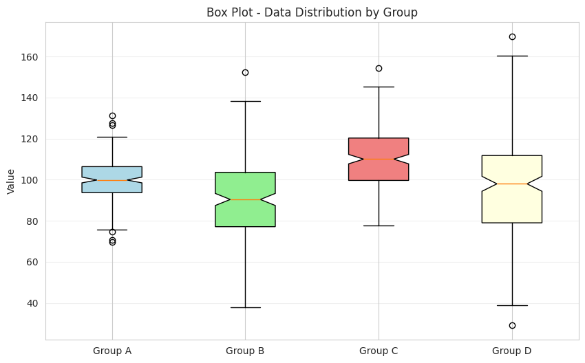

```python
# データの準備
np.random.seed(42)
data = [np.random.normal(100, 10, 200),
        np.random.normal(90, 20, 200),
        np.random.normal(110, 15, 200),
        np.random.normal(95, 25, 200)]

# グラフの作成
fig, ax = plt.subplots(figsize=(10, 6))
box_plot = ax.boxplot(data, labels=['グループA', 'グループB', 'グループC', 'グループD'],
                       patch_artist=True, notch=True)

# 色の設定
colors = ['lightblue', 'lightgreen', 'lightcoral', 'lightyellow']
for patch, color in zip(box_plot['boxes'], colors):
    patch.set_facecolor(color)

plt.ylabel('値')
plt.title('グループ別データ分布（箱ひげ図）')
plt.grid(True, alpha=0.3, axis='y')
plt.show()
```

#### Seabornを使用した箱ひげ図

```python
# データの準備
np.random.seed(42)
df = pd.DataFrame({
    'カテゴリ': np.repeat(['A', 'B', 'C', 'D'], 100),
    '値': np.concatenate([
        np.random.normal(100, 10, 100),
        np.random.normal(90, 20, 100),
        np.random.normal(110, 15, 100),
        np.random.normal(95, 25, 100)
    ])
})

# グラフの作成
plt.figure(figsize=(10, 6))
sns.boxplot(x='カテゴリ', y='値', data=df, palette='Set2')
plt.title('カテゴリ別データ分布（Seaborn箱ひげ図）')
plt.grid(True, alpha=0.3, axis='y')
plt.show()
```

#### バイオリンプロット

```python
# データの準備（箱ひげ図と同じデータを使用）
np.random.seed(42)
df = pd.DataFrame({
    'カテゴリ': np.repeat(['A', 'B', 'C', 'D'], 100),
    '値': np.concatenate([
        np.random.normal(100, 10, 100),
        np.random.normal(90, 20, 100),
        np.random.normal(110, 15, 100),
        np.random.normal(95, 25, 100)
    ])
})

# グラフの作成
plt.figure(figsize=(10, 6))
sns.violinplot(x='カテゴリ', y='値', data=df, palette='muted', inner='box')
plt.title('カテゴリ別データ分布（バイオリンプロット）')
plt.grid(True, alpha=0.3, axis='y')
plt.show()
```

### 8. 3Dプロット

3次元データを表現するのに適しています。

#### 3D散布図

```python
from mpl_toolkits.mplot3d import Axes3D

# データの準備
np.random.seed(42)
n = 100
x = np.random.randn(n)
y = np.random.randn(n)
z = np.random.randn(n)
colors = np.random.randn(n)

# グラフの作成
fig = plt.figure(figsize=(12, 9))
ax = fig.add_subplot(111, projection='3d')

scatter = ax.scatter(x, y, z, c=colors, cmap='viridis', s=50, alpha=0.6)

ax.set_xlabel('X軸')
ax.set_ylabel('Y軸')
ax.set_zlabel('Z軸')
ax.set_title('3D散布図')

plt.colorbar(scatter, ax=ax, pad=0.1)
plt.show()
```

#### 3D曲面プロット

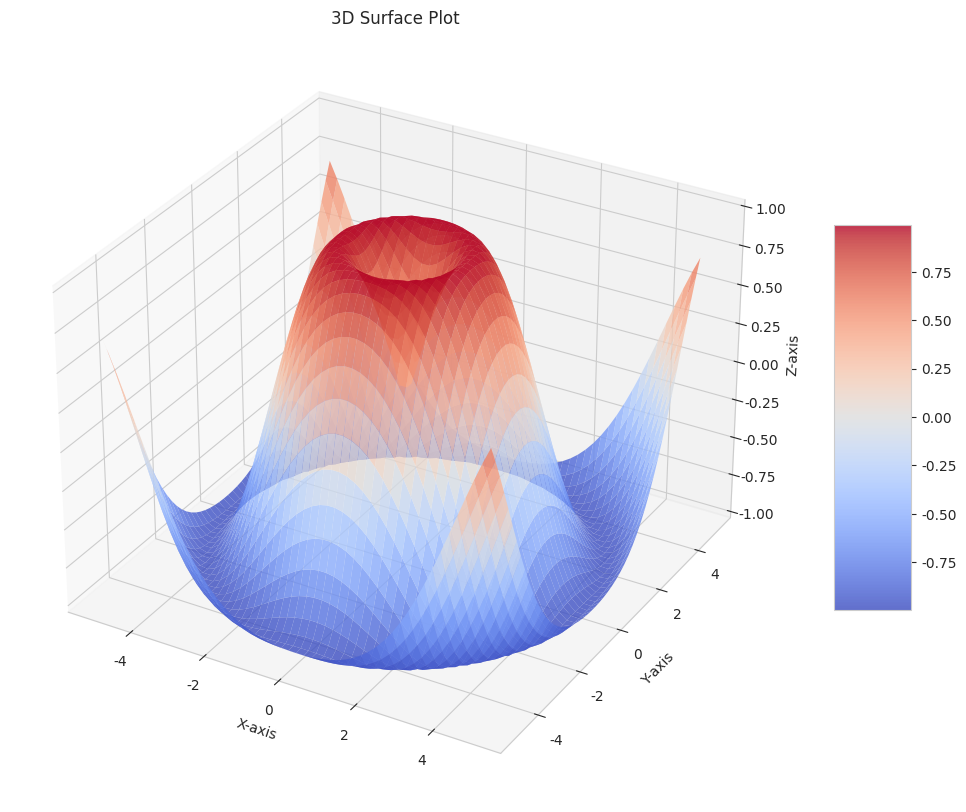

```python
from mpl_toolkits.mplot3d import Axes3D

# データの準備
x = np.linspace(-5, 5, 100)
y = np.linspace(-5, 5, 100)
X, Y = np.meshgrid(x, y)
Z = np.sin(np.sqrt(X**2 + Y**2))

# グラフの作成
fig = plt.figure(figsize=(14, 10))
ax = fig.add_subplot(111, projection='3d')

surf = ax.plot_surface(X, Y, Z, cmap='coolwarm', linewidth=0,
                       antialiased=True, alpha=0.8)

ax.set_xlabel('X軸')
ax.set_ylabel('Y軸')
ax.set_zlabel('Z軸')
ax.set_title('3D曲面プロット')

fig.colorbar(surf, ax=ax, shrink=0.5, aspect=5)
plt.show()
```

#### 3Dワイヤーフレーム

```python
from mpl_toolkits.mplot3d import Axes3D

# データの準備
x = np.linspace(-5, 5, 50)
y = np.linspace(-5, 5, 50)
X, Y = np.meshgrid(x, y)
Z = np.sin(np.sqrt(X**2 + Y**2))

# グラフの作成
fig = plt.figure(figsize=(12, 9))
ax = fig.add_subplot(111, projection='3d')

ax.plot_wireframe(X, Y, Z, color='blue', linewidth=0.5)

ax.set_xlabel('X軸')
ax.set_ylabel('Y軸')
ax.set_zlabel('Z軸')
ax.set_title('3Dワイヤーフレーム')
plt.show()
```

## 高度なテクニック

### サブプロット（複数のグラフを1つの図に配置）

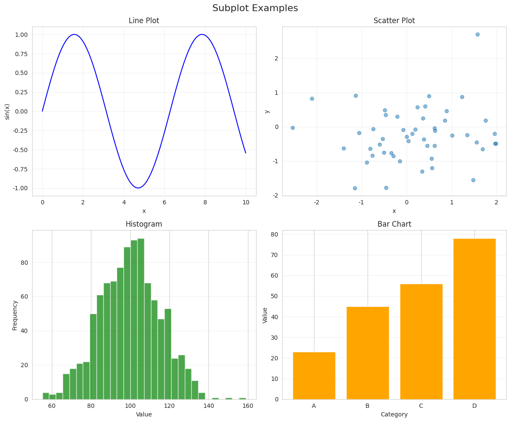

```python
# データの準備
np.random.seed(42)
x = np.linspace(0, 10, 100)

# グラフの作成
fig, axes = plt.subplots(2, 2, figsize=(12, 10))

# 左上：折れ線グラフ
axes[0, 0].plot(x, np.sin(x), 'b-')
axes[0, 0].set_title('折れ線グラフ')
axes[0, 0].set_xlabel('x')
axes[0, 0].set_ylabel('sin(x)')
axes[0, 0].grid(True, alpha=0.3)

# 右上：散布図
axes[0, 1].scatter(np.random.randn(50), np.random.randn(50), alpha=0.5)
axes[0, 1].set_title('散布図')
axes[0, 1].set_xlabel('x')
axes[0, 1].set_ylabel('y')
axes[0, 1].grid(True, alpha=0.3)

# 左下：ヒストグラム
axes[1, 0].hist(np.random.normal(100, 15, 1000), bins=30, color='green', alpha=0.7)
axes[1, 0].set_title('ヒストグラム')
axes[1, 0].set_xlabel('値')
axes[1, 0].set_ylabel('頻度')
axes[1, 0].grid(True, alpha=0.3, axis='y')

# 右下：棒グラフ
categories = ['A', 'B', 'C', 'D']
values = [23, 45, 56, 78]
axes[1, 1].bar(categories, values, color='orange')
axes[1, 1].set_title('棒グラフ')
axes[1, 1].set_xlabel('カテゴリ')
axes[1, 1].set_ylabel('値')
axes[1, 1].grid(True, alpha=0.3, axis='y')

plt.suptitle('サブプロットの例', fontsize=16)
plt.tight_layout()
plt.show()
```

### アニメーション

```python
from matplotlib.animation import FuncAnimation
from IPython.display import HTML

# データの準備
fig, ax = plt.subplots(figsize=(10, 6))
ax.set_xlim(0, 2*np.pi)
ax.set_ylim(-1.5, 1.5)
ax.set_xlabel('x')
ax.set_ylabel('y')
ax.set_title('正弦波のアニメーション')
ax.grid(True, alpha=0.3)

line, = ax.plot([], [], 'b-', linewidth=2)

def init():
    line.set_data([], [])
    return line,

def animate(frame):
    x = np.linspace(0, 2*np.pi, 1000)
    y = np.sin(x + frame/10)
    line.set_data(x, y)
    return line,

# アニメーションの作成
anim = FuncAnimation(fig, animate, init_func=init, frames=100,
                    interval=50, blit=True)

plt.show()

# Jupyter Notebookで表示する場合
# HTML(anim.to_jshtml())
```

### カスタムスタイル

```python
# Seabornのスタイルを使用
styles = ['darkgrid', 'whitegrid', 'dark', 'white', 'ticks']

fig, axes = plt.subplots(2, 3, figsize=(15, 10))
axes = axes.flatten()

for idx, style in enumerate(styles):
    with sns.axes_style(style):
        axes[idx].plot(np.random.randn(100).cumsum())
        axes[idx].set_title(f'Style: {style}')
        axes[idx].set_xlabel('Index')
        axes[idx].set_ylabel('Value')

# 最後の軸を非表示
axes[-1].set_visible(False)

plt.suptitle('Seabornスタイルの比較', fontsize=16)
plt.tight_layout()
plt.show()
```

## グラフの保存

作成したグラフをファイルとして保存する方法：

```python
# 高解像度での保存
fig, ax = plt.subplots(figsize=(10, 6))
ax.plot(np.random.randn(100).cumsum())
ax.set_title('保存するグラフ')
ax.set_xlabel('時間')
ax.set_ylabel('値')
ax.grid(True, alpha=0.3)

# PNG形式で保存（高解像度）
plt.savefig('graph.png', dpi=300, bbox_inches='tight')

# PDF形式で保存（ベクター形式）
plt.savefig('graph.pdf', bbox_inches='tight')

# SVG形式で保存（ベクター形式）
plt.savefig('graph.svg', bbox_inches='tight')

plt.show()
```

## 実践的な例：ダッシュボード風レイアウト

```python
# データの準備
np.random.seed(42)
dates = pd.date_range('2024-01-01', periods=365, freq='D')

# 図の作成
fig = plt.figure(figsize=(16, 10))
fig.suptitle('2024年度 売上ダッシュボード', fontsize=20, fontweight='bold')

# GridSpecを使用したレイアウト
gs = fig.add_gridspec(3, 3, hspace=0.3, wspace=0.3)

# 1. 時系列グラフ（上部全体）
ax1 = fig.add_subplot(gs[0, :])
sales = np.cumsum(np.random.randn(365)) + 1000
ax1.plot(dates, sales, color='#2E86AB', linewidth=2)
ax1.fill_between(dates, sales, alpha=0.3, color='#2E86AB')
ax1.set_title('年間売上推移', fontsize=14, fontweight='bold')
ax1.set_xlabel('日付')
ax1.set_ylabel('売上（万円）')
ax1.grid(True, alpha=0.3)

# 2. 月別売上（棒グラフ）
ax2 = fig.add_subplot(gs[1, 0])
months = ['1月', '2月', '3月', '4月', '5月', '6月']
monthly_sales = np.random.randint(80, 150, 6)
bars = ax2.bar(months, monthly_sales, color='#A23B72')
ax2.set_title('上半期月別売上', fontsize=12, fontweight='bold')
ax2.set_ylabel('売上（万円）')
for bar in bars:
    height = bar.get_height()
    ax2.text(bar.get_x() + bar.get_width()/2., height + 1,
             f'{height}', ha='center', va='bottom', fontsize=10)

# 3. カテゴリ別売上（円グラフ）
ax3 = fig.add_subplot(gs[1, 1])
categories = ['製品A', '製品B', '製品C', '製品D']
sizes = [35, 25, 25, 15]
colors_pie = ['#F18F01', '#C73E1D', '#6A994E', '#A7C957']
ax3.pie(sizes, labels=categories, colors=colors_pie, autopct='%1.1f%%',
        startangle=90)
ax3.set_title('カテゴリ別売上構成', fontsize=12, fontweight='bold')

# 4. 地域別売上（横棒グラフ）
ax4 = fig.add_subplot(gs[1, 2])
regions = ['関東', '関西', '中部', '九州', '東北']
regional_sales = [450, 380, 290, 210, 170]
bars_h = ax4.barh(regions, regional_sales, color='#55A630')
ax4.set_title('地域別売上', fontsize=12, fontweight='bold')
ax4.set_xlabel('売上（万円）')
for bar in bars_h:
    width = bar.get_width()
    ax4.text(width + 5, bar.get_y() + bar.get_height()/2.,
             f'{width}', ha='left', va='center', fontsize=10)

# 5. 売上分布（ヒストグラム）
ax5 = fig.add_subplot(gs[2, 0])
daily_sales = np.random.normal(100, 20, 365)
ax5.hist(daily_sales, bins=30, color='#7209B7', alpha=0.7, edgecolor='black')
ax5.axvline(daily_sales.mean(), color='red', linestyle='dashed',
            linewidth=2, label=f'平均: {daily_sales.mean():.1f}')
ax5.set_title('日別売上分布', fontsize=12, fontweight='bold')
ax5.set_xlabel('売上（万円）')
ax5.set_ylabel('頻度')
ax5.legend()

# 6. 相関ヒートマップ
ax6 = fig.add_subplot(gs[2, 1:])
metrics = pd.DataFrame({
    '売上': np.random.randn(100),
    '訪問者数': np.random.randn(100),
    '広告費': np.random.randn(100),
    '在庫': np.random.randn(100),
    '従業員数': np.random.randn(100)
})
correlation = metrics.corr()
im = ax6.imshow(correlation, cmap='RdBu_r', aspect='auto', vmin=-1, vmax=1)
ax6.set_xticks(np.arange(len(correlation.columns)))
ax6.set_yticks(np.arange(len(correlation.columns)))
ax6.set_xticklabels(correlation.columns, rotation=45, ha='right')
ax6.set_yticklabels(correlation.columns)
ax6.set_title('指標間の相関', fontsize=12, fontweight='bold')

# 値を表示
for i in range(len(correlation.columns)):
    for j in range(len(correlation.columns)):
        text = ax6.text(j, i, f'{correlation.iloc[i, j]:.2f}',
                       ha="center", va="center", color="black", fontsize=10)

plt.colorbar(im, ax=ax6, fraction=0.046, pad=0.04)

plt.tight_layout()
plt.show()
```

## まとめ

このチュートリアルでは、Pythonで作成できる主要なグラフの種類とその実装方法を紹介しました。各グラフの特徴を理解し、データの性質と目的に応じて適切なグラフを選択することが重要です。

### グラフ選択のガイドライン

| データの種類 | 推奨グラフ | 用途 |
|------------|-----------|------|
| 時系列データ | 折れ線グラフ | トレンドや変化の把握 |
| カテゴリ比較 | 棒グラフ | 異なるカテゴリ間の値の比較 |
| 2変数の関係 | 散布図 | 相関関係の確認 |
| データ分布 | ヒストグラム、箱ひげ図 | データの分散や外れ値の確認 |
| 構成比 | 円グラフ | 全体に対する各部分の割合 |
| 多次元データ | ヒートマップ | パターンや相関の視覚化 |
| 3次元データ | 3Dプロット | 空間的な関係の表現 |

### ベストプラクティス

1. **適切なグラフタイプの選択**：データの性質と伝えたいメッセージに応じて選択
2. **明確なラベル付け**：軸ラベル、タイトル、凡例を必ず含める
3. **色の使い方**：色覚異常に配慮した配色を使用
4. **データインクレシオ**：不要な装飾を避け、データそのものに焦点を当てる
5. **一貫性**：同じレポート内では統一されたスタイルを使用

### 追加リソース

- [Matplotlib公式ドキュメント](https://matplotlib.org/stable/contents.html)
- [Seaborn公式ドキュメント](https://seaborn.pydata.org/)
- [Pandas Visualization](https://pandas.pydata.org/docs/user_guide/visualization.html)
- [Plotly（インタラクティブなグラフ）](https://plotly.com/python/)

これらのサンプルコードをベースに、自分のデータに合わせてカスタマイズし、効果的なデータビジュアライゼーションを作成してください。